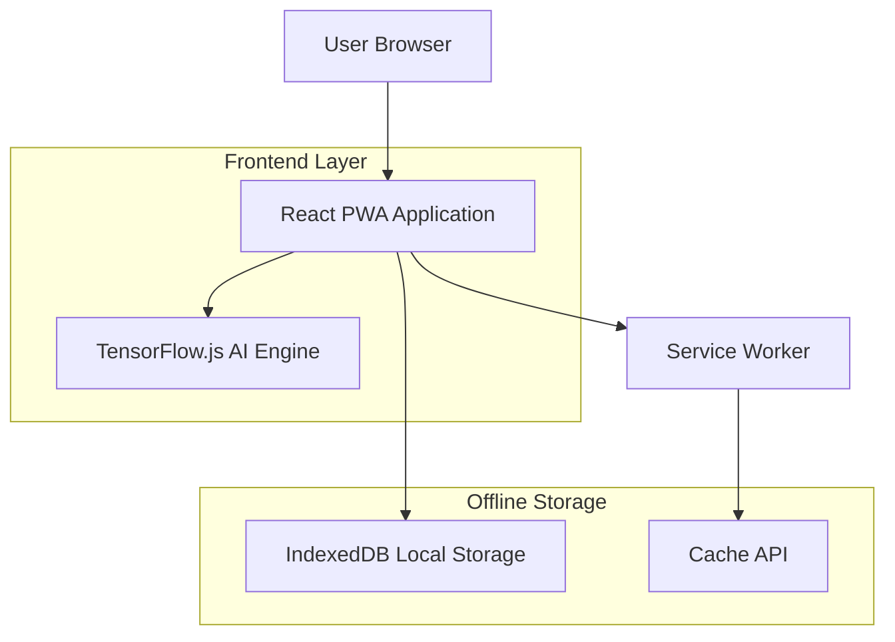
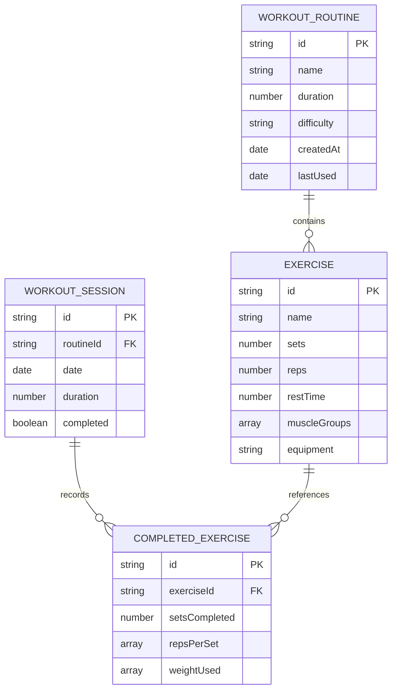

## 1. Architecture design



## 2. Technology Description
- Frontend: React@18 + TypeScript + Vite
- Initialization Tool: vite-init
- Backend: None (100% cliente-side)
- State Management: Zustand
- IA/ML: TensorFlow.js + ONNX.js
- PWA: Workbox para offline functionality
- UI Framework: TailwindCSS + HeadlessUI
- Charts: Chart.js
- Animaciones: Framer Motion

## 3. Route definitions
| Route | Purpose |
|-------|---------|
| / | Página de inicio con selector de modo |
| /rutinas | Creador y gestor de rutinas de entrenamiento |
| /progreso | Dashboard con estadísticas y visualizaciones |
| /ejercicios | Biblioteca completa de ejercicios |
| /configuracion | Panel de privacidad y ajustes |
| /entrenamiento | Interfaz activa durante ejercicios |

## 4. API definitions
### 4.1 Core Local APIs

Rutina Management
```
interface WorkoutRoutine {
  id: string;
  name: string;
  exercises: Exercise[];
  duration: number;
  difficulty: 'beginner' | 'intermediate' | 'advanced';
  createdAt: Date;
  lastUsed?: Date;
}

interface Exercise {
  id: string;
  name: string;
  sets: number;
  reps: number;
  restTime: number;
  muscleGroups: string[];
  equipment?: string;
}
```

Progreso Tracking
```
interface WorkoutSession {
  id: string;
  routineId: string;
  date: Date;
  duration: number;
  completed: boolean;
  exercises: CompletedExercise[];
}

interface CompletedExercise {
  exerciseId: string;
  setsCompleted: number;
  repsPerSet: number[];
  weightUsed?: number[];
}
```

## 5. Server architecture diagram
No aplica - aplicación 100% cliente-side sin servidor backend.

## 6. Data model

### 6.1 Data model definition


### 6.2 Data Definition Language
IndexedDB Schema (JavaScript)
```javascript
// Database initialization
db.version(1).stores({
  routines: 'id, name, difficulty, createdAt, lastUsed',
  exercises: 'id, name, muscleGroups, equipment',
  sessions: 'id, routineId, date, completed',
  completedExercises: 'id, sessionId, exerciseId',
  userSettings: 'key, value',
  aiModels: 'name, version, data'
});

// Privacy-focused local storage
const privacySettings = {
  dataRetentionDays: 365,
  autoDeleteOldData: true,
  incognitoMode: false,
  allowAnalytics: false
};

// AI model storage for offline inference
const aiModelSchema = {
  name: 'workoutRecommendation',
  version: '1.0.0',
  data: ArrayBuffer, // ONNX model
  metadata: {
    accuracy: 0.92,
    lastTrained: '2024-01-01'
  }
};
```