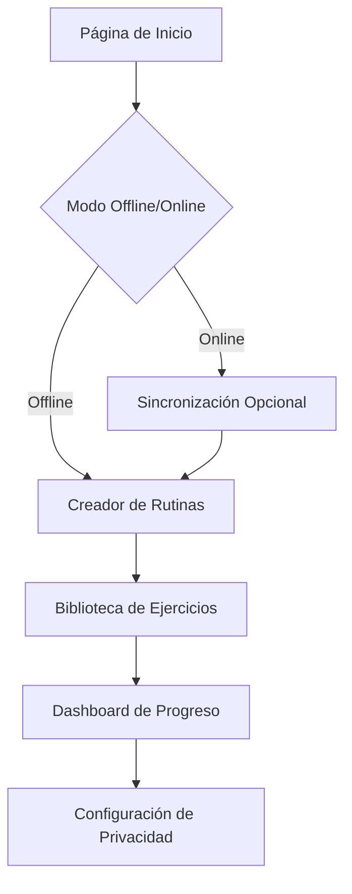

## 1. Product Overview
Aplicación web de entrenamiento personal con inteligencia artificial que funciona offline y prioriza la privacidad del usuario. Permite crear rutinas personalizadas, seguimiento de progreso y recomendaciones adaptativas sin necesidad de conexión constante.

- Resuelve el problema de privacidad en apps de fitness tradicionales
- Dirigido a personas preocupadas por su privacidad que quieren entrenar en cualquier lugar
- Funciona 100% offline con IA embebida en el navegador

## 2. Core Features

### 2.1 User Roles
| Role | Registration Method | Core Permissions |
|------|---------------------|------------------|
| Usuario | Registro local/offline | Acceso completo a todas las funciones offline |
| Usuario Invitado | Sin registro | Acceso limitado a rutinas predefinidas |

### 2.2 Feature Module
Nuestra app de entrenamiento personal consiste en las siguientes páginas principales:
1. **Página de Inicio**: bienvenida, selector de modo offline/online, acceso rápido a rutinas.
2. **Creador de Rutinas**: interfaz drag-and-drop para crear rutinas personalizadas, selector de ejercicios, configuración de series y repeticiones.
3. **Dashboard de Progreso**: visualización de estadísticas, gráficos de evolución, logros y metas.
4. **Biblioteca de Ejercicios**: catálogo completo con filtros por grupo muscular, dificultad, equipamiento.
5. **Configuración de Privacidad**: controles de datos locales, exportación/importación, modo incógnito.

### 2.3 Page Details
| Page Name | Module Name | Feature description |
|-----------|-------------|---------------------|
| Página de Inicio | Selector de Modo | Alternar entre modo offline completo y online con sincronización opcional |
| Página de Inicio | Acceso Rápido | Mostrar últimas rutinas usadas y favoritas en cards interactivas |
| Creador de Rutinas | Constructor Visual | Arrastrar y soltar ejercicios para crear rutinas personalizadas con duración configurable |
| Creador de Rutinas | IA Adaptativa | Sugerir rutinas basadas en nivel físico, disponibilidad de tiempo y objetivos |
| Dashboard de Progreso | Visualizaciones | Mostrar gráficos de progreso semanal/mensual con datos locales |
| Dashboard de Progreso | Logros | Desbloquear medallas por consistencia y mejoras personales |
| Biblioteca de Ejercicios | Filtros Inteligentes | Buscar ejercicios por múltiples criterios con resultados instantáneos |
| Biblioteca de Ejercicios | Descripciones Detalladas | Mostrar técnica correcta, músculos trabajados y variaciones |
| Configuración de Privacidad | Control de Datos | Permitir usuario ver, exportar y eliminar todos los datos locales |
| Configuración de Privacidad | Modo Incógnito | Entrenar sin guardar historial temporalmente |

## 3. Core Process
**Flujo de Usuario Principal:**
El usuario accede a la app, selecciona modo offline para máxima privacidad, crea o selecciona una rutina existente, completa el entrenamiento con seguimiento automático, y revisa su progreso en el dashboard. Todos los datos se almacenan localmente en IndexedDB.

## 4. User Interface Design

### 4.1 Design Style
- **Colores Primarios**: Verde oscuro (#2D5016) y blanco para transmitir salud y frescura
- **Colores Secundarios**: Gris carbón (#333333) y acento naranja (#FF6B35) para CTAs
- **Estilo de Botones**: Redondeados con sombras sutiles, efecto hover con cambio de color
- **Tipografía**: Inter para headers, Roboto para body text, tamaños 16px base
- **Layout**: Card-based con grid responsive, navegación lateral collapsable
- **Iconos**: Estilo lineal minimalista, consistente en todo el app

### 4.2 Page Design Overview
| Page Name | Module Name | UI Elements |
|-----------|-------------|-------------|
| Página de Inicio | Hero Section | Imagen de fondo dinámica con overlay oscuro, título prominente, CTA principal en verde |
| Creador de Rutinas | Canvas Principal | Área drag-and-drop con grid visual, timeline horizontal para duración, panel lateral de ejercicios |
| Dashboard de Progreso | Gráficos | Charts circulares para objetivos diarios, líneas temporales para tendencias, cards de estadísticas |
| Biblioteca de Ejercicios | Grid de Cards | Layout masonry adaptativo, cards con imagen placeholder, badges de dificultad, hover effects |
| Configuración de Privacidad | Panel de Control | Toggle switches para opciones, botones de exportación con iconos, secciones claramente separadas |

### 4.3 Responsiveness
Desktop-first con adaptación completa a tablets y móviles. Touch optimization para ejercicios de temporización. Breakpoints: 1200px, 768px, 480px. Menú hamburguesa en móvil con swipe gestures.

### 4.4 3D Scene Guidance
No aplica para esta aplicación enfocada en UI 2D y funcionalidad offline.